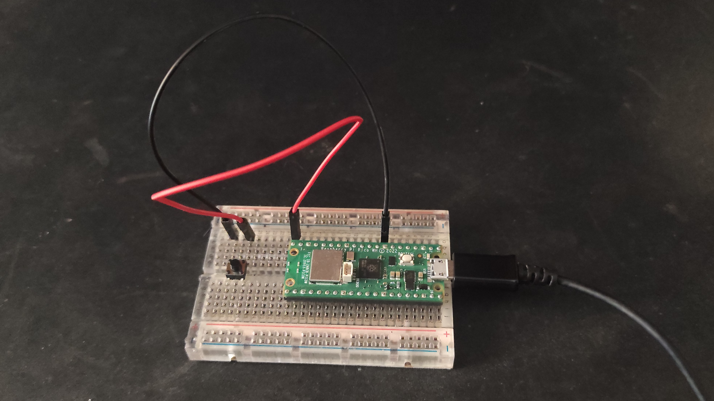

# Raspberry Pi Pico W LED Blinker Using Polling
A simple project which controls the on-board LED on the pico w using a push button. It's made using the simplest method which is polling.
## Componenets Used
* Raspberry Pi Pico W
* Breadboard
* 4-pin Push Button
* Jumper Wires

The button is connected to GPIO 15, which is physical pin number 20.
## Implementation
The processor keeps checking whether the input from GPIO 15 is 0. If it is, then it turns on the on-board LED, sleeps for half a second and then turns it off. It's worth noting that the on-board LED on the pico w is controlled by the wireless chip. As a result, this project is **not** going to work on a normal pico.

## Images
An image of the breadboard layout is presented below.

## Binaries folder
In case you are not interested in building the project and only want to load the .elf or .uf2 files on your pico w, I included a "binaries" folder containing only those two files.

## Similar projects to this one
If you found this project interesting and want to see a different implementation, using interrupts instead of polling, you can find it [here](https://github.com/PanagiotisKarath/PicoW-LED-Blink-Interrupts). By using interrupts we achieve better CPU utilization, with minimal changes to the code.